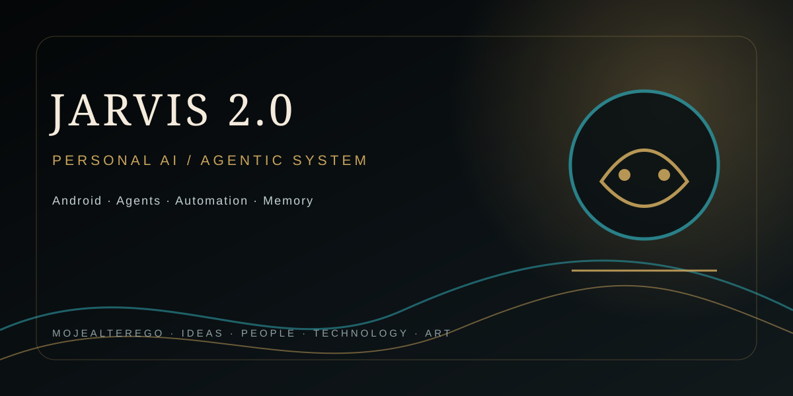

## MOJEALTEREGO · PROJECT PROFILE

---

# JARVIS 2.0

Real Android AI assistant project.

## Repository layout

- `jarvis-2-android/` — native Android application built with Expo / React Native.
- `backend/` — authenticated Node.js API used by the mobile client.
- `.github/workflows/` — cloud APK build pipeline using EAS Build.

## Security

Secrets are never committed to this repository. The backend reads credentials from environment variables. The Android client stores its API URL and bearer token in secure device storage.

For CI, configure the GitHub Actions repository secret `EXPO_TOKEN` with an Expo access token. Never paste the token into source files or chat.

## Android build

The `preview` EAS profile produces an installable APK. The `production` profile is configured for an Android App Bundle.

## Backend

The backend defaults to port `8787` and supports authenticated API access through `JARVIS_API_TOKEN`. Its current persistence layer is a JSON state file; PostgreSQL configuration is reserved for the next persistence phase.

## Current status

Foundation initialized: Expo Android shell, command center, authenticated API client, backend core API, and EAS CI pipeline.
