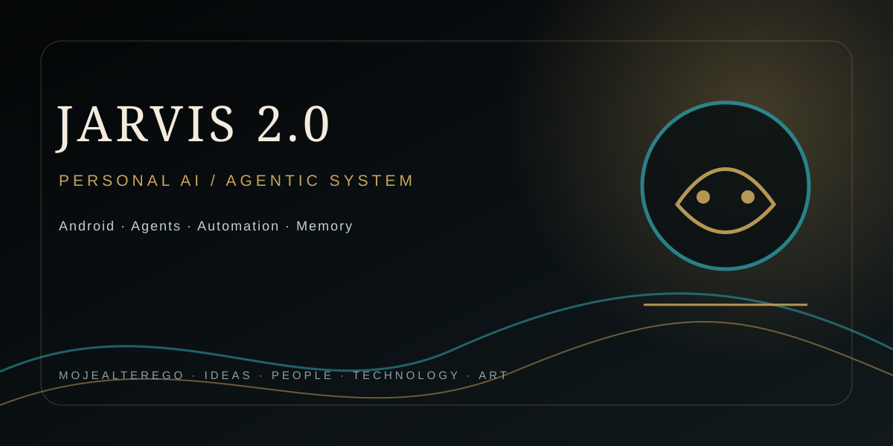

<div align="center">

</div>

# JARVIS 2.0

Android assistant using Expo SDK 57 and a separate authenticated Node.js backend.

## Implemented behavior

- Text conversation through the OpenAI Responses API, with the last 12 messages supplied by the client.
- Microphone recording, server-side transcription and Android speech output.
- Task creation and completion, persistent memory, approval decisions, agent configuration status and automation configuration.
- Secure device storage for the server URL and bearer token. Saving an empty token field preserves the existing token; removing it requires the dedicated control.
- Bounded JSON/audio uploads, authentication on API endpoints, validated mutations, serialized state transactions and atomic file replacement.
- GitHub Actions checks for TypeScript, Expo configuration, the Android JavaScript bundle, backend regression tests and the container build.

Automation records are configuration only: this version has no scheduler or external action executor. Research is a conversation configuration, not an autonomous browsing agent. PostgreSQL, Google and Telegram are not connected by this implementation.

## Start the backend

Requires Node.js 22 or newer. Run these commands from the repository root:

```sh
cd backend
npm install
node scripts/setup-env.mjs
npm start
```

The setup command creates a private `.env` containing a generated API token. An existing `.env` is preserved. Configure `OPENAI_API_KEY` there to enable chat and transcription, then restart the backend. OpenAI keys belong on the backend only. The token is read from `.env` and entered in the Android connection settings; do not commit it.

The default port is 8787. `JARVIS_STATE_FILE` defaults to `./jarvis-state.json`, preserving the previous local location. The file adapter supports one backend process per state file. Existing corrupt state stops initialization instead of being overwritten.

`OPENAI_MODEL` defaults to `gpt-6-astra`; `OPENAI_MODEL_FAST` and `OPENAI_MODEL_COMPLEX` optionally override routing. Model availability depends on the API account. A missing API key returns HTTP 503. Provider failures return 502/503/504 rather than a fabricated success.

## Connect Android

Run the app, open Settings and enter the backend URL and its API token. Use a reachable HTTPS URL for a public backend. The emulator default `http://10.0.2.2:8787` points to the emulator host; it is not an address for a physical phone. A private LAN IP can be used for local development.

The client rejects public HTTP URLs. Local HTTP remains unencrypted and is intended for trusted development networks. The Android native configuration enables cleartext support for this local use and disables Android backup. The client has a 90-second timeout.

```sh
cd jarvis-2-android
npm install
npm run typecheck
npx expo start
```

## Android APK and AAB

The [Android workflow](https://github.com/mojealterego/JARVIS-2.0/actions/workflows/jarvis-android.yml) verifies the application, waits for EAS Build and downloads a completed APK. It uses the existing EAS project and `EXPO_TOKEN` repository secret.

When EAS fails or is unavailable, the workflow builds an APK and AAB on the GitHub runner with Gradle. These fallback files use the generated debug keystore and are internal testing builds. They are not store-ready signed releases. EAS `production` remains configured for an Android App Bundle with managed credentials.

Successful files appear in the workflow's `JARVIS-2.0-Android-<commit>` artifact together with `SHA256SUMS.txt` and `build-info.json`, which identify the exact source commit and signing provenance. A started workflow is not evidence that an APK exists.

## Tests

```sh
cd backend
npm test
docker build -t jarvis-backend .
```

The 18 backend regressions exercise authentication, client contracts, 32 concurrent writes, restart persistence, immutable IDs, approval conflicts, upload limits and Responses parsing. AI transport is replaced by test fixtures; these tests do not validate a paid live provider call or physical microphone hardware.

For a container deployment, run `docker compose up --build` from `backend/`. Compose binds port 8787 to host loopback and persists state in a named volume. Put an HTTPS reverse proxy in front of it for public access. Set `JARVIS_ALLOWED_ORIGINS` to a comma-separated allowlist only when using a browser client; native Android requests do not require CORS.

## Repository structure

| Path | Responsibility |
| --- | --- |
| `jarvis-2-android/app/` | Android screens |
| `jarvis-2-android/lib/api.ts` | Typed client and device credentials |
| `backend/src/domain/` | Validation and application errors |
| `backend/src/application/` | JARVIS use cases |
| `backend/src/infrastructure/` | State storage, OpenAI transport and uploads |
| `backend/src/http/` | HTTP transport and authentication |
| `backend/test/` | Backend regression tests |
| `.github/workflows/` | Verification and Android builds |

## Dependency audit — 2026-10-09

The [dependency check](https://github.com/mojealterego/JARVIS-2.0/actions/runs/37992735670) passes Expo SDK compatibility after aligning React Native to 0.86.3 and the SDK 57 native peers. A UUID override to 11.1.1 reduces the npm report from 28 to 21 affected package entries (18 high, 3 moderate). These entries derive from three underlying advisories; the audit is not clean.

| Dependency | Advisory | Current handling |
| --- | --- | --- |
| braces | [GHSA-vfj7-8cjw-p6xm](https://github.com/advisories/GHSA-vfj7-8cjw-p6xm) | Upstream advisory lists no patched version; remains in the Metro/build dependency chain. |
| node-forge | [GHSA-86w9-cpqp-85rv](https://github.com/advisories/GHSA-86w9-cpqp-85rv) | Upstream advisory lists no patched version; remains in Expo certificate tooling. |
| decode-uri-component | [GHSA-vcc3-ghjq-m6fr](https://github.com/advisories/GHSA-vcc3-ghjq-m6fr) | Upstream 0.5.0 is ESM; Expo Router 57 uses query-string 7 with a CommonJS decoder import. A direct override would change that runtime contract. An SDK-compatible routing update is still required. |

The report is preserved as a workflow artifact. Forced npm downgrades to older Expo/React Native SDKs have not been applied. Production release requires resolving or assessing the remaining dependency findings and testing the app on a device.

## Verification status — 2026-10-09

The [backend verification](https://github.com/mojealterego/JARVIS-2.0/actions/runs/37991814756) passed all 18 regression tests, built the container and verified authenticated health and task persistence against the running container. AI calls use test fixtures.

The repaired TypeScript, Expo configuration and Android JavaScript bundle passed in CI. The latest native APK/AAB is still being verified after the dependency and URL-policy updates. The client also has three regression tests covering HTTPS enforcement, misleading domain names and local development URLs. Final build links and artifact provenance will be recorded when native compilation finishes.

No physical-device verification, live OpenAI call or production deployment has been performed in this session.
